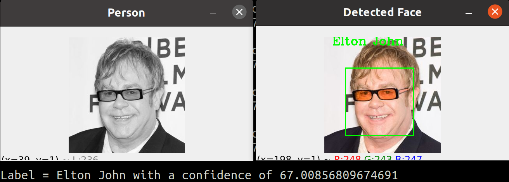

# Detectar caras y reconocer caras entrenando un modelo
Para ejecutar este pograma hay que tener instalado opencv.
Pimero hay que ejecutar el archivo `train.py` para entrenar al modelo y luego ejecutar `recognition.py`para obtener las predicciones.

# Primera parte crear el train
1. [Creamos lista con los nombres de los artitas que vamos a reconocer](#schema1)
2. [Cargamos el clasificador y creamos una variable donde guardarmos le dirección donde tenemos las fotos](#schema2)
3. [Creamos el train](#scehma3)
4. [Entrenamos el reconocedor con las objetos que tenemos](#schema4)

# Segunda parte reconocer al personaje
5. [Cargamos el clasificador, los archivos creados con el train y creamos lista con los nombres de los personajes](#schema5)
6. [Creamos el reconocedor y caramos el archivo ](#schema6)
7. [Cargamos una imagen aleatoria,  la convertimos a gris y la mostramos](#schema7)
8. [Detectar la cara en la imágen](#schema8)
9. [Hacer las predicciones y mostar por pantalla imagén con el nombre del artista.](#schema9)

# 1. Creamos lista con los nombres de los artitas que vamos a reconocer
~~~python
people = ['Ben Afflek', 'Elton John', 'Jerry Seinfield', 'Madonna', 'Mindy Kaling']
~~~

# 2. Cargamos el clasificador y creamos una variable donde guardarmos le dirección donde tenemos las fotos
~~~python
haar_cascade = cv.CascadeClassifier('haar_face.xml')

DIR = r'./Faces/train'
~~~

# 3. Creamos el train
~~~python
features = []
labels = []

def create_train():
    for person in people:
        #creamos el path  y el etiqueta de cada persona
        path = os.path.join(DIR, person)
        label = people.index(person)
        #leemos cada imagen
        for img in os.listdir(path):
            img_path = os.path.join(path,img)
            img_array = cv.imread(img_path)

            if img_array is None:
                continue 
            #convertimos a gris las imágenes    
            gray = cv.cvtColor(img_array, cv.COLOR_BGR2GRAY)
            #detectamos las caras.
            faces_rect = haar_cascade.detectMultiScale(gray, scaleFactor=1.1, minNeighbors=4)
            #las guardamos
            for (x,y,w,h) in faces_rect:
                faces_roi = gray[y:y+h, x:x+w]
                features.append(faces_roi)
                labels.append(label)

~~~
La función `detectMultiScale `se utiliza para detectar las caras. Se necesitan 3 argumentos:

Imagen de entrada
ScaleFactor
MinNeighbours

# 4. Entrenamos el reconocedor con las objetos que tenemos

~~~python
features = np.array(features, dtype='object')
labels = np.array(labels)
#Creamos el reconocedor
face_recognizer = cv.face.LBPHFaceRecognizer_create()

face_recognizer.train(features,labels)
#guardamos los archivos generados para poder cargarlos a la hora validar las imágenes
face_recognizer.save('face_trained.yml')
np.save('features.npy', features)
np.save('labels.npy', labels)
~~~

# 5. Cargamos el clasificador, los archivos creados con el train y creamos lista con los nombres de los personajes
~~~python
haar_cascade = cv.CascadeClassifier('haar_face.xml')

features = np.load('features.npy', allow_pickle=True)
labels = np.load('labels.npy')

people = ['Ben Afflek', 'Elton John', 'Jerry Seinfield', 'Madonna', 'Mindy Kaling']
~~~

# 6. Creamos el reconocedor y caramos el archivo 
~~~python
face_recognizer = cv.face.LBPHFaceRecognizer_create()
face_recognizer.read('face_trained.yml')
~~~

# 7. cargamos una imagen aleatoria,  la convertimos a gris y la mostramos
~~~python
img = cv.imread(r'./Faces/val/elton_john/1.jpg')

gray = cv.cvtColor(img, cv.COLOR_BGR2GRAY)
cv.imshow('Person', gray)
~~~

# 8. Detectar la cara en la imágen
~~~python
faces_rect = haar_cascade.detectMultiScale(gray, 1.1, 4)
~~~

# 9. Hacer las predicciones y mostar por pantalla imagén con el nombre del artista.
~~~python
for (x,y,w,h) in faces_rect:
    faces_roi = gray[y:y+h,x:x+w]

    label, confidence = face_recognizer.predict(faces_roi)
    print(f'Label = {people[label]} with a confidence of {confidence}')

    #Dibujar los recuadros alrededor del rostro y poner el nombre del artista
    cv.putText(img, str(people[label]), (20,20), cv.FONT_HERSHEY_COMPLEX, 1.0, (0,255,0), thickness=2)
    cv.rectangle(img, (x,y), (x+w,y+h), (0,255,0), thickness=2)

cv.imshow('Detected Face', img)
cv.waitKey(0)

~~~

